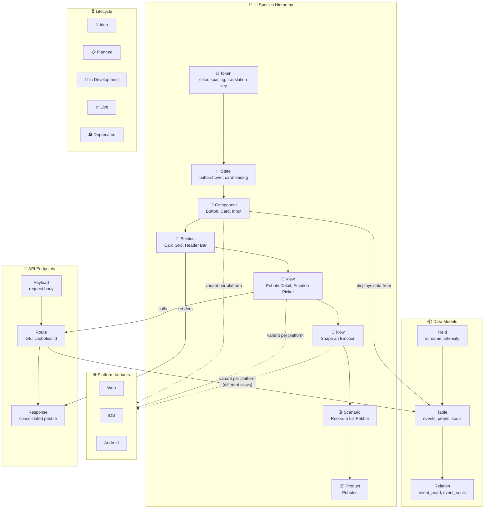

This is a [Next.js](https://nextjs.org) project bootstrapped with [`create-next-app`](https://nextjs.org/docs/app/api-reference/cli/create-next-app).

## Getting Started

First, run the development server:

```bash
npm run dev
# or
yarn dev
# or
pnpm dev
# or
bun dev
```

Open [http://localhost:3000](http://localhost:3000) with your browser to see the result.

You can start editing the page by modifying `app/page.tsx`. The page auto-updates as you edit the file.

This project uses [`next/font`](https://nextjs.org/docs/app/building-your-application/optimizing/fonts) to automatically optimize and load [Geist](https://vercel.com/font), a new font family for Vercel.

## Documentation

See [`docs/`](docs/README.md) for detailed documentation:

- [Architecture](docs/architecture.md) — System design, component relationships, data flow
- [Graph Model](docs/graph-model.md) — Species hierarchy, statuses, platforms, edge types
- [Data Layer](docs/data-layer.md) — DataProvider interface, storage, import/export
- [Conventions](docs/conventions.md) — Coding patterns, file organization, state management

## Learn More

To learn more about Next.js, take a look at the following resources:

- [Next.js Documentation](https://nextjs.org/docs) - learn about Next.js features and API.
- [Learn Next.js](https://nextjs.org/learn) - an interactive Next.js tutorial.

You can check out [the Next.js GitHub repository](https://github.com/vercel/next.js) - your feedback and contributions are welcome!

## Deploy on Vercel

The easiest way to deploy your Next.js app is to use the [Vercel Platform](https://vercel.com/new?utm_medium=default-template&filter=next.js&utm_source=create-next-app&utm_campaign=create-next-app-readme) from the creators of Next.js.

Check out our [Next.js deployment documentation](https://nextjs.org/docs/app/building-your-application/deploying) for more details.

## Vision

Existing tools silo product knowledge: Jira for stories, Figma for screens, Notion for docs, dbdiagram for schemas, Swagger for APIs. No tool lets you **traverse across all these layers fluidly** — from a user story down to the API payload it touches, or from a database table up to which screens render its data, across platforms.

**arkaik** is a **product graph browser**. Not a task tracker. Not a wiki. Not a design tool. It's a navigable, multi-dimensional map of a product's full anatomy — from pixels to payloads.

### Who is this for?

- Solo founders and indie devs who wear every hat
- Small product teams where design, engineering, and data overlap
- Anyone who needs to model the full vertical of a product in one place

### Core principles

- **One graph, not many docs** — everything is a node, everything can be linked
- **Opinionated ontology** — the tool *knows* what a story, a component, a data model is
- **Semantic zoom** — start at the product level, drill down to a color token
- **Platform-aware** — first-class support for Web, iOS, Android variants
- **Local-first** — works offline, data is yours, open-source friendly

---

## The Species Model (Atomic Hierarchy)

Inspired by Atomic Design, extended upward into flows and scenarios. Every entity in arkaik belongs to a **species** — a level in the composition hierarchy.

| **Level** | **Species** | **Examples** | **Composes from** |
| --- | --- | --- | --- |
| 0 | 🎨 Token | Color token, spacing value, translation key | — |
| 1 | ◻️ State | Button:hover, Card:loading, Input:error | Tokens |
| 2 | 🧩 Component | Button, Card, Input, Emotion Wheel | States |
| 3 | 📐 Section | Card grid, Header bar, Navigation drawer | Components |
| 4 | 📄 View | Pebble detail page, Emotion picker page | Sections |
| 5 | 🔀 Flow | "Shape an emotion", "Relate souls" | Views |
| 6 | 🎬 Scenario | "Record a full pebble" | Flows |
| 7 | 📦 Product | Pebbles, teale | Scenarios |

### Three orthogonal dimensions

Every node in the graph is described across three axes:

1. **Species** — *what it is* (level in the hierarchy above)
2. **Platform variant** — *where it lives* (Web, iOS, Android), with interface, version, availability
3. **Lifecycle status** — *where it's at* (Idea → Planned → In Development → Live → Deprecated)

### Parallel layers: Data & API

Alongside the UI species hierarchy, two parallel layers connect to it:

- **Data Models** — tables, fields, relations (e.g. `events`, `pearl`, `event_pearl`). Linked to the components and views that *display* them.
- **API Endpoints** — routes, methods, payloads, responses (e.g. `GET /pebbles/:id → consolidated pebble`). Linked to the data models they *query* and the views that *call* them.

---

## Architecture Map



---

## Interaction Model: Semantic Zoom

### Level 0 — Product map

Central node(s) = Products. Radiating out = Scenarios. Bird's-eye view. Clean, minimal, just names and status badges.

### Level 1 — Scenario anatomy

Click a Scenario → it expands in-place. You see the Flows that compose it, laid out as connected blocks. Flows can be sequential or parallel.

### Level 2 — Flow anatomy (workflow view)

Click a Flow → it expands into a flowchart:

- **View nodes** = If shared across all 3 platforms → single node with "stacked" indicator. Click to unfold platform variants.
- **Platform-specific nodes** = When a view differs per platform → 1–3 separate nodes, color-coded (Web 🟢, iOS 🔵, Android 🟣).
- **Condition nodes** = Diamonds between views:
    - *User action* ("Tap save button")
    - *Data condition* ("Has feature flag X?", "Is authenticated?")
    - *Branching arrows* to different next views
- **Dead-end nodes** = Error states, empty states, permission walls (red/dashed border).

### Level 3 — View detail

Click a view node → side panel slides in:

- Platform variants as tabs (screenshot/mockup or placeholder note)
- Linked components used in this view
- Linked data models and API endpoints
- Status badge

### Node types

| **Node type** | **Shape** | **Click behavior** |
| --- | --- | --- |
| Product | Large circle | Expand scenarios |
| Scenario | Rounded rect | Expand flows |
| Flow | Rounded rect, accent border | Expand into flowchart |
| View | Rect, possibly stacked | Open detail panel with platform variants |
| Condition | Diamond | Shows label (user action, data check) |
| Dead-end | Rect, red/dashed border | Error view, empty state |

### Key UX patterns

- **Breadcrumbs** — always visible: `Pebbles > Record a Pebble > Shape an Emotion > View 3`
- **Minimap** — small overview in the corner (React Flow built-in)
- **Ghost nodes** — "Idea" status nodes render as dashed/faded
- **Cross-layer shortcuts** — icon on any view node to jump to Data Model or API Endpoint in a side panel

---

## Tech Stack

| **Layer** | **Choice** | **Why** |
| --- | --- | --- |
| Framework | Next.js (App Router) | SSR, file-based routing, Vercel-native |
| Graph canvas | React Flow | Most mature interactive node graph lib, built-in minimap, grouping, custom nodes |
| UI components | Shadcn/ui + Tailwind | Beautiful, composable, copy-paste components |
| Local storage | localStorage (MVP) → Dexie.js / IndexedDB (upgrade) | No server needed for MVP, easy migration later |
| Database (later) | Supabase (Postgres) | Auth, RLS, Realtime, easy migration from local |
| Hosting | Vercel | Zero-config deploys for Next.js |
| Repo | GitHub | CI/CD, issues, open-source ready |

---

## Data Model

### Schema (local-first, Supabase-ready)

```sql
-- Projects: the top-level container
create table projects (
  id uuid primary key default gen_random_uuid(),
  name text not null,
  description text,
  created_at timestamptz default now()
);

-- Nodes: every entity in the graph
create table nodes (
  id uuid primary key default gen_random_uuid(),
  project_id uuid not null references projects(id) on delete cascade,
  title text not null,
  species text not null check (species in (
    'product','scenario','flow','view','component',
    'section','token','state','data_model','api_endpoint'
  )),
  status text default 'idea' check (status in (
    'idea','planned','in_dev','live','deprecated'
  )),
  platforms text[] default '{}',
  description text,
  created_at timestamptz default now()
);

-- Edges: connections between nodes
create table edges (
  id uuid primary key default gen_random_uuid(),
  project_id uuid not null references projects(id) on delete cascade,
  source_id uuid references nodes(id) on delete cascade,
  target_id uuid references nodes(id) on delete cascade,
  edge_type text default 'composes' check (edge_type in (
    'composes','calls','displays','queries'
  )),
  label text,
  created_at timestamptz default now()
);
```

### Data access abstraction

```
src/lib/data/
  types.ts            ← shared types (Node, Edge, Project)
  data-provider.ts    ← interface: getNodes(), createNode(), etc.
  local-provider.ts   ← implements with localStorage / IndexedDB
  supabase-provider.ts ← (later) implements with Supabase client
```

All React components import from `data-provider`, never from storage directly. Swapping from local to Supabase = changing one import.

### Config-driven ontology

```tsx
// src/lib/config/species.ts
export const SPECIES = [
  { key: 'product', label: 'Product', icon: '📦', level: 7 },
  { key: 'scenario', label: 'Scenario', icon: '🎬', level: 6 },
  { key: 'flow', label: 'Flow', icon: '🔀', level: 5 },
  { key: 'view', label: 'View', icon: '📄', level: 4 },
  { key: 'section', label: 'Section', icon: '📐', level: 3 },
  { key: 'component', label: 'Component', icon: '🧩', level: 2 },
  { key: 'state', label: 'State', icon: '◻️', level: 1 },
  { key: 'token', label: 'Token', icon: '🎨', level: 0 },
  { key: 'data_model', label: 'Data Model', icon: '📦', level: null },
  { key: 'api_endpoint', label: 'API Endpoint', icon: '🔌', level: null },
] as const;

export const STATUSES = [
  { key: 'idea', label: 'Idea', color: 'gray' },
  { key: 'planned', label: 'Planned', color: 'blue' },
  { key: 'in_dev', label: 'In Development', color: 'orange' },
  { key: 'live', label: 'Live', color: 'green' },
  { key: 'deprecated', label: 'Deprecated', color: 'red' },
] as const;

export const EDGE_TYPES = [
  { key: 'composes', label: 'Composes' },
  { key: 'calls', label: 'Calls' },
  { key: 'displays', label: 'Displays data from' },
  { key: 'queries', label: 'Queries' },
] as const;

export const PLATFORMS = [
  { key: 'web', label: 'Web', color: '🟢' },
  { key: 'ios', label: 'iOS', color: '🔵' },
  { key: 'android', label: 'Android', color: '🟣' },
] as const;
```

---

## Folder Structure

```
arkaik/
  src/
    app/                          ← Next.js App Router
      page.tsx                    ← Home: project selector
      project/[id]/
        page.tsx                  ← Graph canvas for a project
        layout.tsx                ← Project layout (breadcrumb, sidebar)
    components/
      graph/
        Canvas.tsx                ← React Flow wrapper
        nodes/
          ProductNode.tsx
          ScenarioNode.tsx
          FlowNode.tsx
          ViewNode.tsx
          ConditionNode.tsx
          DataModelNode.tsx
          ApiEndpointNode.tsx
        edges/
          ComposeEdge.tsx
          CrossLayerEdge.tsx
      panels/
        NodeDetailPanel.tsx       ← Shadcn Sheet, slide-in on click
        NewNodeForm.tsx
        PlatformVariants.tsx
      layout/
        Breadcrumb.tsx
        Minimap.tsx
        Sidebar.tsx
        StatusBadge.tsx
        PlatformDots.tsx
    lib/
      config/
        species.ts
        platforms.ts
        statuses.ts
        edge-types.ts
      data/
        types.ts
        data-provider.ts
        local-provider.ts
      hooks/
        useProject.ts
        useNodes.ts
        useEdges.ts
        useGraphNavigation.ts    ← expand/collapse, semantic zoom
      utils/
        layout.ts                ← dagre auto-layout helper (later)
        export.ts                ← JSON export/import
    seed/
      pebbles.json               ← Example Pebbles project data
  public/
  tailwind.config.ts
  next.config.ts
  package.json
```

---

## Export / Import (Open Source Ready)

From day one, every project can be exported as a single JSON bundle and re-imported:

```tsx
interface ProjectBundle {
  version: string;
  project: Project;
  nodes: Node[];
  edges: Edge[];
}
```

This unlocks:

- **Open source self-hosting** — clone repo, run locally, import/export graphs
- **SaaS "fork a project"** — import a bundle under a new `project_id`
- **Templates** — ship example projects (like Pebbles) as seed JSON files

---

## Migration Path

| **Phase** | **What** | **How** |
| --- | --- | --- |
| MVP (now) | Local-first, single user | `local-provider` with localStorage |
| Phase 2 | Supabase backend | Write `supabase-provider`, swap provider, add RLS on `project_id` |
| Phase 3 | Auth + profiles | Supabase Auth, `profiles` table, `project_members` join table |
| Phase 4 | Multi-tenant SaaS | Each user sees their projects, can create new ones |
| Open source | Self-hosted | Same repo, `local-provider` or self-hosted Supabase |

---

## Running Example: Pebbles

### Product: Pebbles

**Scenario:** Record a Pebble

- **Flow:** Create the record → Views: Set the time, Set the intensity
- **Flow:** Shape an emotion → Views: Open emotion wheel, Select primary, Refine secondary
- **Flow:** Relate souls → Views: Search contacts, Select soul, Confirm
- **Flow:** Add a card → Views: Choose card type, Write content, Attach

**Data Models:** `events` (pebble), `pearl`, `event_pearl`, `pearl_emotions`, `souls`, `event_souls`, `profiles`, `cards`, `event_cards`

**API Endpoints:**

- `GET /pebbles/:id` → Consolidated pebble (full relations)
- `GET /pebbles` → List of compact pebbles (lighter)
- `POST /pebbles` → Create a new pebble
- `PUT /pebbles/:id/emotions` → Attach emotions to a pebble