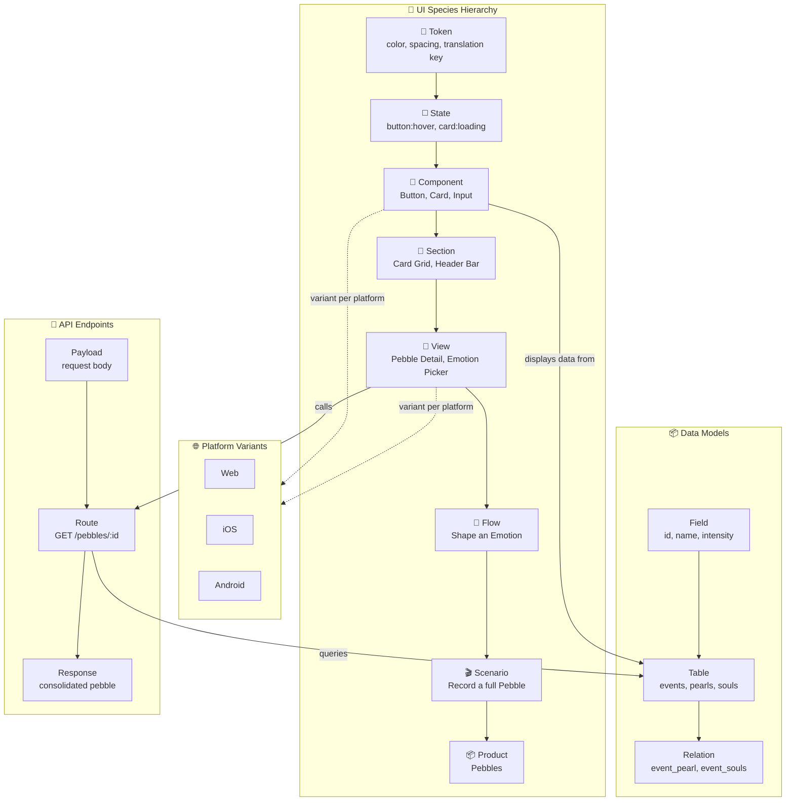

# Vision

> This document describes the full vision for arkaik — including features not yet implemented.  
> For the current state, see [architecture.md](architecture.md) and [graph-model.md](graph-model.md).

## The Problem

Existing tools silo product knowledge: Jira for stories, Figma for screens, Notion for docs, dbdiagram for schemas, Swagger for APIs. No tool lets you **traverse across all these layers fluidly** — from a user story down to the API payload it touches, or from a database table up to which screens render its data, across platforms.

## What arkaik Is

**arkaik** is a **product graph browser**. Not a task tracker. Not a wiki. Not a design tool. It's a navigable, multi-dimensional map of a product's full anatomy — from pixels to payloads.

### Who Is This For?

- Solo founders and indie devs who wear every hat
- Small product teams where design, engineering, and data overlap
- Anyone who needs to model the full vertical of a product in one place

### Core Principles

- **One graph, not many docs** — everything is a node, everything can be linked
- **Opinionated ontology** — the tool *knows* what a flow, a component, a data model is
- **Semantic zoom** — start at the product level, drill down to a color token
- **Platform-aware** — first-class support for Web, iOS, Android variants
- **Local-first** — works offline, data is yours, open-source friendly

## The Species Model (Atomic Hierarchy)

Inspired by Atomic Design, extended upward into flows, scenarios, and the product. Every entity in arkaik belongs to a **species** — a level in the composition hierarchy.

| Level | Species | Examples | Composes from |
|---|---|---|---|
| 0 | 🎨 Token | Color token, spacing value, translation key | — |
| 1 | ◻️ State | Button:hover, Card:loading, Input:error | Tokens |
| 2 | 🧩 Component | Button, Card, Input, Emotion Wheel | States |
| 3 | 📐 Section | Card grid, Header bar, Navigation drawer | Components |
| 4 | 📄 View | Pebble detail page, Emotion picker page | Sections |
| 5 | 🔀 Flow | "Shape an emotion", "Relate souls" | Views |
| 6 | 🎬 Scenario | "Record a full pebble" | Flows |
| 7 | 📦 Product | Pebbles, teale | Scenarios |

> **Current implementation:** Only levels 4–5 are implemented as `view` and `flow`. Levels 0–3 and 6–7 are planned. See [graph-model.md](graph-model.md) for the live species list.

### Three Orthogonal Dimensions

Every node in the graph is described across three axes:

1. **Species** — *what it is* (level in the hierarchy above)
2. **Platform variant** — *where it lives* (Web, iOS, Android)
3. **Lifecycle status** — *where it's at* (Idea → Live → Archived)

### Parallel Layers: Data & API

Alongside the UI species hierarchy, two parallel layers connect to it:

- **Data Models** — tables, fields, relations. Linked to components and views that *display* them.
- **API Endpoints** — routes, methods, payloads, responses. Linked to data models they *query* and views that *call* them.

## Interaction Model: Semantic Zoom

### Level 0 — Product map

Central node(s) = Products. Radiating out = Scenarios. Bird's-eye view, just names and status badges.

### Level 1 — Scenario anatomy

Click a Scenario → it expands in-place. Flows that compose it, laid out as connected blocks.

### Level 2 — Flow anatomy (workflow view)

Click a Flow → it expands into a flowchart:

- **View nodes** — if shared across all platforms: single node with stacked indicator. Click to unfold platform variants.
- **Platform-specific nodes** — when a view differs per platform: 1–3 nodes, color-coded (Web, iOS, Android).
- **Condition nodes** — diamonds between views: user action, data condition, branching arrows.
- **Dead-end nodes** — error states, empty states, permission walls (dashed border).

### Level 3 — View detail

Click a view → side panel slides in:

- Platform variants as tabs (mockup or placeholder note)
- Linked components used in this view
- Linked data models and API endpoints
- Status badge

### Key UX Patterns

- **Breadcrumbs** — always visible: `Pebbles > Record a Pebble > Shape an Emotion > View 3`
- **Minimap** — small overview in the corner
- **Ghost nodes** — "Idea" status nodes render as dashed/faded
- **Cross-layer shortcuts** — icon on any view node to jump to Data Model or API Endpoint

## Architecture Diagram



## Planned Data Model

The full vision targets a Supabase-backed schema:

```sql
-- Nodes: every entity in the graph
-- species: token | state | component | section | view | flow | scenario | product | data-model | api-endpoint
-- status: idea | backlog | prioritized | development | releasing | live | archived | blocked

create table nodes (
  id uuid primary key default gen_random_uuid(),
  project_id uuid not null references projects(id) on delete cascade,
  title text not null,
  species text not null,
  status text default 'idea',
  platforms text[] default '{}',
  description text,
  metadata jsonb,
  created_at timestamptz default now()
);
```

> The current `localStorage` implementation already uses this shape — the migration path to Supabase does not require data transformation, only a provider swap. See [data-layer.md](data-layer.md#migration-path) for details.

## Roadmap

| Phase | Feature |
|---|---|
| Current | `flow` + `view` species, per-platform statuses, playlist composition, JSON import/export |
| Near-term | Component and section species (levels 2–3) |
| Mid-term | Token and state species (levels 0–1), Supabase backend |
| Long-term | Scenario and product species (levels 6–7), multi-user, real-time sync |
