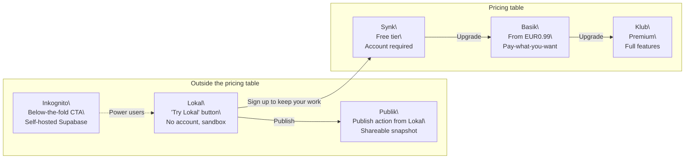

# Vision

> This document describes long-term direction while staying aligned with the current architecture.
> Source of truth for implemented behavior: [architecture.md](architecture.md), [graph-model.md](graph-model.md), and [data-layer.md](data-layer.md).

## Problem Statement

Product knowledge is usually fragmented across planning docs, design files, API specs, and database tools. Teams lose time reconstructing dependencies between user-facing behavior, backend calls, and data storage.

arkaik targets that gap with one navigable graph.

## Offering Model

The arkaik offering is structured around **3 pricing tiers** visible on the pricing page, plus **3 complementary modes** that live outside the pricing table as entry points or power-user options.

### The Full Picture

## Complementary Modes (Outside Pricing)

### Lokal: The Sandbox

Not a tier. A **Try Lokal** button next to Sign in on the landing page.

- No account, no server, no sign-up
- Full editor experience in browser storage (Dexie.js / IndexedDB)
- Limited features (no AI, no assets, no version history)
- Manual JSON export to save work
- Clear warning that browser cache clearing can remove local data
- Purpose: zero-friction entry point before account commitment
- Conversion trigger: when users need backups, sharing, or more features, prompt Sign up to keep your work and migrate local data to account mode

Current implementation references: [lib/data/local-provider.ts](../lib/data/local-provider.ts), [lib/utils/export.ts](../lib/utils/export.ts), [app/project/[id]/canvas/page.tsx](../app/project/[id]/canvas/page.tsx)

### Publik: The Share Action

Not a tier. A publish feature available from Lokal (and potentially paid tiers).

- User clicks Publish on a project
- arkaik stores a raw JSON snapshot and returns a shareable project ID URL (for example, `arkaik.app/p/abc123`)
- Anyone with the URL can import and edit a copy locally
- Owner key (UUID) is generated once at publish time and required to delete the snapshot
- Publish flow includes a disclaimer that arkaik does not guarantee retention of published snapshots
- Product framing: GitHub Gist for product graphs

### Inkognito: The Sovereign Option

Not a tier. A below-the-fold pricing-page CTA for power users.

- Local-first operation backed by the user's own Supabase project
- arkaik provides setup scripts, migration scripts, and documentation
- Full features including asset uploads (to user-owned Supabase buckets)
- No arkaik account required; AI features excluded
- Target audience: developers prioritizing full data sovereignty
- arkaik infra cost: zero
- Schema migrations are user-managed, with release-aligned scripts provided by arkaik

## Pricing Tiers

|  | **Synk** | **Basik** | **Klub** |
|---|---|---|---|
| **Tagline** | Save your work | Own your workflow | Unlock everything |
| **Price** | Free | From EUR0.99/mo | TBD |
| **Account** | Required | Required | Required |

### Storage And Sync

|  | **Synk** | **Basik** | **Klub** |
|---|---|---|---|
| **Source of truth** | Browser (Dexie) | Browser (Dexie) | Browser (Dexie) |
| **Server storage** | arkaik server (JSON backups) | arkaik Supabase (consolidated) | arkaik Supabase (consolidated) |
| **Sync method** | Interval backup (~1 min) | Real-time sync | Real-time sync |
| **Version history** | 7 days | 30 days | Unlimited |
| **Data persistence** | Server backups | Server + local | Server + local |

### Features And Limits

|  | **Synk** | **Basik** | **Klub** |
|---|---|---|---|
| **Entity limit** | ~250 synced | ~1,000 synced | Unlimited |
| **Projects** | 1 | 3 | Unlimited |
| **Asset uploads** | No | Limited (TBD) | Yes (arkaik bucket) |
| **AI features** | No | No (or low credits) | Yes |
| **Sharing** | JSON export + Publik | JSON export + Publik | JSON export + Publik + future collaboration |
| **Import / Export** | Yes | Yes | Yes |

### Infrastructure

|  | **Synk** | **Basik** | **Klub** |
|---|---|---|---|
| **arkaik server** | Backup service only | Full Supabase | Full Supabase |
| **Data responsibility** | Shared (best-effort backups) | arkaik-managed guarantees | arkaik-managed guarantees |
| **arkaik infra cost** | Low | Medium | Medium to High |

## Core Product Direction (Unchanged)

The pricing and mode model above should preserve current graph and UX foundations.

### Graph Model Continuity

The core model remains centered on four species:

- `flow`: ordered sequence container
- `view`: reusable screen/page node
- `data-model`: data entity node
- `api-endpoint`: API contract node

Flow behavior remains playlist-driven (`metadata.playlist.entries`) and can anchor from optional `project.root_node_id`.

Config source: [lib/config/species.ts](../lib/config/species.ts)

### UX Continuity

- Keep canvas route for spatial graph editing and sequence expansion
- Keep library route for dense browsing, filtering, and metadata audit workflows
- Keep sidebar shell for stable in-project navigation between both modes
- Keep reuse-first authoring with where-used visibility and insert-between operations

Implementation references: [app/project/[id]/canvas/page.tsx](../app/project/[id]/canvas/page.tsx), [app/project/[id]/library/page.tsx](../app/project/[id]/library/page.tsx), [components/layout/ProjectSidebar.tsx](../components/layout/ProjectSidebar.tsx), [components/panels/NodeDetailPanel.tsx](../components/panels/NodeDetailPanel.tsx), [components/panels/InsertBetweenDialog.tsx](../components/panels/InsertBetweenDialog.tsx), [lib/utils/where-used.ts](../lib/utils/where-used.ts), [lib/utils/elk-layout.ts](../lib/utils/elk-layout.ts)

### Platform And Status Continuity

- Keep per-platform status editing on `view` nodes
- Keep `flow` status as computed rollup from descendant views
- Keep lifecycle state visible in cards, panels, and table rows

Config sources: [lib/config/platforms.ts](../lib/config/platforms.ts), [lib/config/statuses.ts](../lib/config/statuses.ts)

### Data Layer Continuity

- Preserve the `DataProvider` abstraction so UI and hooks stay backend-agnostic
- Continue local-first operation with import/export
- Add tier-aware backend behavior without breaking existing contracts

Implementation references: [lib/data/data-provider.ts](../lib/data/data-provider.ts), [lib/data/local-provider.ts](../lib/data/local-provider.ts), [lib/utils/export.ts](../lib/utils/export.ts)

## User Journeys

### Journey 1: Casual Explorer

1. User lands on `arkaik.app` and clicks Try Lokal.
2. User explores the graph editor and creates a few nodes.
3. User wants persistent backup and signs up, becoming a Synk user.
4. Local project data migrates into account-backed storage.

### Journey 2: Sharer

1. User builds a graph in Lokal.
2. User clicks Publish and receives a Publik URL plus owner key.
3. Recipients import the graph into their own Lokal or account workspace.

### Journey 3: Power User

1. User starts on Synk and reaches project or entity limits.
2. User upgrades to Basik for larger capacity and real-time sync.
3. User later upgrades to Klub for AI features, unlimited entities, and richer asset support.

### Journey 4: Sovereign Developer

1. User discovers Inkognito on the pricing page.
2. User provisions Supabase and runs arkaik migration/setup scripts.
3. User runs arkaik with full local-first behavior and no dependency on arkaik-hosted infrastructure.

## Open Questions

- [ ] Basik pricing model: fixed monthly versus pay-what-you-want
- [ ] Entity limits: validate whether 250 (Synk) and 1,000 (Basik) match real project distributions
- [ ] Publik moderation: define minimal report and takedown process for harmful content
- [ ] Publik owner key UX: define recovery or account-link fallback when key is lost
- [ ] Lokal to Synk migration: test Dexie-to-server migration early as the primary conversion funnel
- [ ] Inkognito migrations: commit to versioned migration artifacts from the first release
