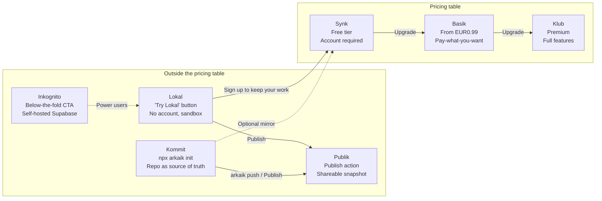

# Vision

> This document describes long-term direction while staying aligned with the current architecture.
> Source of truth for implemented behavior: [architecture.md](architecture.md), [graph-model.md](graph-model.md), and [data-layer.md](data-layer.md).
> Normative format and tooling specifications live in [spec/](spec/bundle-format.md).

## Problem Statement

Product knowledge is usually fragmented across planning docs, design files, API specs, and database tools. Teams lose time reconstructing dependencies between user-facing behavior, backend calls, and data storage.

arkaik targets that gap with one navigable graph.

But a map that only shows the present is half a map. Product teams don't just ask *"what is the status of this screen?"* — they ask *"when did it ship?"*, *"what changed between v1.2 and v1.3?"*, *"which ideas are waiting?"*, *"what does the release note say?"*. Today's bundle is a static snapshot that answers only the first question.

## Thesis: From Snapshot to Living Journal

The `ProjectBundle` evolves from a static export into a **living record of a product's anatomy over time**:

- The **snapshot** stays what it is today — the current state of the graph, importable as a single JSON file. A snapshot-only bundle remains valid forever.
- An optional **journal** — an append-only log of typed events (status transitions, releases, ideas, requests, reference updates) — captures how the product got there.
- **Projections** derived from the journal give users the features a static map cannot: per-node status timelines, changelogs between versions, release notes, and an ideas/requests backlog.

This is deliberately layered (see [Format Levels](#format-levels)): nobody is forced to adopt the journal, and the single-file import experience never degrades.

The second half of the thesis: **arkaik is not just an app**. Its most committed users keep their product map *in their repository, next to their code*, maintained by coding agents as a side effect of development — that is exactly how arkaik itself uses the [agent skill](arkaik-skill/skill.md) with the Pebbles project. For them, the repo is the source of truth and arkaik.app is a lens. Serving that persona well requires treating the format and the tooling as products in their own right.

And a corollary this vision previously under-served, now that the lower layers have shipped: **the lens itself**. One canvas cannot simultaneously serve a strategist zooming out, an operator zooming in, and an agent querying programmatically. The app answer is **one graph, many maps** — the same bundle read through purpose-built projections, each consumable by humans as a page and by agents as a function ([§ Core Product](#core-product-one-graph-many-maps), normative spec in [spec/maps.md](spec/maps.md)).

## The Four Layers

arkaik is structured as four layers, each usable without the ones above it.

| Layer | What it is | License | Status |
|---|---|---|---|
| **1. Format** | The open, versioned `ProjectBundle` + journal + references specification | MIT | **Shipped** — v2 published at `public/schema/project-bundle.json`, generated from `@arkaik/schema` ([spec/bundle-format.md](spec/bundle-format.md)) |
| **2. Toolchain** | npm packages: `@arkaik/schema`, the `arkaik` CLI (init, validate, log, release, sync, pack, open, push), the agent skill + Claude Code plugin, a zero-dependency validator artifact | MIT | **Shipped** — `packages/schema`, `packages/cli`, `plugin/`; MCP server specified next ([spec/mcp.md](spec/mcp.md)) |
| **3. App** | arkaik.app — the graph viewer/editor (hosted; later possibly a local viewer via static export) | AGPL-3.0 | Live — local-first via IndexedDB (Dexie), optional Synk accounts; **core experience under reconstruction** ([§ Core Product](#core-product-one-graph-many-maps)) |
| **4. Services** | Sync, hosting, sharing, integrations: the Synk/Basik/Klub tiers, Publik snapshots, Inkognito self-hosting | AGPL / commercial | **Free surface shipped** — Publik + Synk with Auth.js accounts; monetization (Basik/Klub) deliberately gated behind Core Product |

Design rule: **each layer only depends on the layer below it.** The app renders anything that conforms to the format; the services sync anything the app can hold. A user can adopt the format with zero arkaik infrastructure (a JSON file in a repo), and every additional layer is opt-in convenience.

The npm channel is the standard for repo-native developer tooling — Storybook, Changesets, shadcn, and husky all live inside consuming repositories this way. A system package manager (brew) targets machine-global binaries and would miss the actual audience: JavaScript-adjacent product repos and their CI.

## Personas & Journeys

### Journey 1: Casual Explorer

1. User lands on `arkaik.app` and clicks Try Lokal.
2. User explores the graph editor and creates a few nodes.
3. User wants persistent backup and signs up, becoming a Synk user.
4. Local project data migrates into account-backed storage.

### Journey 2: Sharer

1. User builds a graph in Lokal.
2. User clicks Publish and receives a Publik URL plus owner key.
3. Recipients import the graph into their own Lokal or account workspace.

### Journey 3: Power User

1. User starts on Synk and reaches project or entity limits.
2. User upgrades to Basik for larger capacity and real-time sync.
3. User later upgrades to Klub for AI features, unlimited entities, and richer asset support.

### Journey 4: Sovereign Developer

1. User discovers Inkognito on the pricing page.
2. User deploys the AGPL app + services to their own host, provisions a Postgres, and runs the release-aligned `db/migrations` scripts.
3. User runs arkaik with full local-first behavior and no dependency on arkaik-hosted infrastructure.

### Journey 5: Git-Native Builder (Kommit)

The persona the current vision missed — and the one arkaik's own development embodies.

1. Developer runs `npx arkaik init` in their product repo. It scaffolds `docs/arkaik/` (bundle + journal), installs the agent skill into the repo's skills directory, and configures merge attributes.
2. Their coding agents maintain the map as a side effect of code changes: surgical patches to the snapshot, appended events to the journal, validator as a hard gate (optionally in CI).
3. `arkaik sync` mirrors external status (GitHub/GitLab/Linear issues, PR/MRs) into the map's references.
4. When they want to *see* the map, they open arkaik.app and import the packed bundle — or publish it via Publik / push it to a synced account project.
5. `arkaik release` tags a version, generates release notes from the journal, and compacts history.

The repo is the source of truth; every arkaik surface above it is a lens. Proposed working name for this mode, in the family of the others: **Kommit**.

## Format Levels

The format supports three adoption levels. Higher levels are strictly additive — every level remains valid indefinitely, and consumers must accept all of them. This answers the size concern directly: history never bloats the snapshot, because it never has to live inside it.

| Level | What the user maintains | What it unlocks | Cost |
|---|---|---|---|
| **0 — Static snapshot** | `bundle.json` only (today's format) | The full current-state graph experience | None — this is today |
| **1 — Versioned snapshot** | Snapshot + `schema_version` + release tags | Named versions, per-tier snapshot retention (the 7-day/30-day/unlimited version history of Synk/Basik/Klub), safe schema migrations | One integer field + tagging discipline |
| **2 — Snapshot + journal** | Snapshot + append-only event journal (sidecar `journal.jsonl` in repos; embedded `journal[]` only as a single-file interchange projection) | Status timelines, changelog between versions, release notes, ideas & requests backlog | Dual-write discipline (automated by the skill/CLI) |

Two authority rules keep the levels honest (normative details in [spec/journal.md](spec/journal.md)):

- **The snapshot is authoritative for current state; the journal is authoritative for history.** The app never silently re-derives one from the other; the validator cross-checks them by value (for example, the last `node.status_changed.to` must match the node's current `status`).
- **Unknown event types and unknown fields are preserved and ignored.** The event vocabulary can grow without breaking older consumers.

Status stops being a mutable field that forgets, and becomes the *current value* of a tracked evolution: an idea is proposed (`idea.proposed`), becomes a node (`node.created`), moves through the lifecycle (`node.status_changed`), ships in a version (`release.tagged`), and appears in a generated release note — all without changing what a Level 0 user has to care about.

## References, Assets & Integrations

A product map that cannot point at the design file, the issue, or the pull request forces users back into the fragmentation arkaik exists to solve. The v2 format adds typed **references** on nodes (shape specified in [spec/bundle-format.md](spec/bundle-format.md)):

| Ref type | Examples | Status mirroring |
|---|---|---|
| `figma` | Design file / frame preview links | None (link + optional cached thumbnail) |
| `github-issue`, `gitlab-issue`, `linear-issue` | The ticket driving a node | External status mirrored, optionally mapped to the arkaik lifecycle |
| `github-pr`, `gitlab-mr` | The code change implementing a node | Open / merged / closed mirrored |
| `url` | Anything else (specs, dashboards) | None |

**Status sync is a mode-appropriate concern, not one global mechanism:**

- **Kommit:** `arkaik sync` reads refs, queries the external APIs with locally provided tokens (env vars in dev or CI), updates the mirrored status, and appends `ref.status_changed` events. Agents can do the same as part of the skill workflow. No arkaik server involved.
- **Paid tiers (Klub first):** server-side integrations and webhooks keep refs fresh without a repo or CI — a natural premium surface.

### Asset Policy

Screenshots and previews are where storage gets critical, and the rule that keeps every mode coherent is: **the bundle carries references, not blobs.** An asset value is one of:

| Form | Where the bytes live | Mode |
|---|---|---|
| Relative path (`assets/web/home.png`) | The user's repo, next to the bundle | Kommit |
| Absolute URL | Figma, arkaik bucket (Basik/Klub), user-owned Supabase bucket (Inkognito) | All hosted modes |
| Data URI | Inline in the bundle | Lokal / legacy only — discouraged |

Today the app stores screenshots as base64 data URIs inside the bundle (`metadata.platformScreenshots`, written by `components/panels/NodeDetailPanel.tsx`). That is a size bomb: it presses against the 5 MB import cap, the 4 MB export warning, and the localStorage quota simultaneously, and it is the one place the current code and the published schema have already drifted apart. The v2 spec legitimizes all three forms; `arkaik pack` inlines or uploads assets when a self-contained interchange file is needed. Journal events never carry asset payloads — only the fact that an asset changed.

## Core Product: One Graph, Many Maps

> Normative companion: [spec/maps.md](spec/maps.md). Agent plane: [spec/mcp.md](spec/mcp.md).

### The Honest Diagnosis

The lower layers sprinted ahead of the lens. Today the canvas anchors on `project.root_node_id` and renders only its *flow* children — a view-rooted bundle (the Pebbles seed's exact shape) renders **one card out of 147 nodes**. Data models and API endpoints never appear on the canvas at all, which silences 201 of the seed's 277 edges. The library's species filter duplicates the sidebar. There is no surface that answers "what is in flight on Android?" — the question per-platform statuses exist for. A map that is rich in data and poor in readings is a filing cabinet, not a map.

### The App Thesis

A **map is a named, parameterized projection over (snapshot, journal)**: a scope (root anchor), a selection (species, edge types), and a rendering mode (canvas, board, dashboard). Projections live in `@arkaik/schema` beside `computeChangelog` — the app renders them, the CLI prints them, the MCP server serves them.

**Audience symmetry** is the design rule that follows: *every human surface has an agent-consumable twin*, produced by the same function. A strategist reads the Overview; an agent calls the same aggregation. An operator drags through the Delivery board; an agent queries the same (node × platform, status) tuples. Nothing is rendered that cannot be queried, and nothing is queryable that has no home on screen.

### The Built-in Maps

| Map | Centered on | Answers | Rendering |
|---|---|---|---|
| **Journey** | Navigation | "How does a user move through the product?" | Compose/playlist drill-down canvas (today's canvas, with the traversal fixed) |
| **System** | The model | "Which screens render this data model? What does this endpoint feed?" | All four species as cards, cross-layer edges drawn, ELK-layered by species tier |
| **Delivery** | Product status | "What is in flight on Android? What shipped on iOS?" | Board of (node × platform) items grouped by status — a view `live` on iOS and `prioritized` on Android appears in **both** columns, by design |
| **Overview** | The whole | "Where does this product stand?" | Dashboard: per-platform delivery gauges, release pulse and backlog from the journal, inventory, coverage/health indicators |

**Custom maps are data**, not features: a `MapDefinition` stored at `project.metadata.maps` scopes any archetype to a root anchor — the admin area versus the user app is two saved maps, not a format extension. Humans create them in a dialog; **agents author them by writing JSON**. ("Area" tags remain a future format revision if root-scoping proves insufficient — see Open Questions.)

### The Information Architecture

The sidebar reorganizes around three groups, replacing the single-canvas "Navigate":

- **Project** — the product-level reading: Overview, Delivery, Changelog. This is where strategists land.
- **Maps** — the graph readings: Journey, System, and saved custom maps. This is where structure is explored and edited.
- **Library** — the dense inventory: one page per species, driven by the sidebar (the sidebar is the *only* species selector; the in-page species filter is removed as redundant). This is where operators audit.

Zooming is a continuum, not a mode switch: Overview links into maps, maps open the node detail panel, the panel deep-links back into scoped maps and the library.

### The Agent Plane

The skill made agents good *writers*; the format made them competent *readers*. The **MCP server** ([spec/mcp.md](spec/mcp.md)) makes them conversational participants: the projections above exposed as tools, plus validator-gated dual-write mutations (`actor: "arkaik-mcp"`). Repo-local (Kommit, stdio, `npx -y arkaik-mcp`) first — zero infrastructure, serving the persona that already lives in the repo. A hosted agent surface over Synk projects is the natural Klub-tier follow-up, on the tier-enforcement seam that already exists.

### Continuity Guardrails (unchanged)

- **Graph model**: the four species, playlist-driven flows (`metadata.playlist.entries`), optional `project.root_node_id` anchor. Config source: `lib/config/species.ts`
- **Platform and status**: per-platform status editing on `view` nodes; `flow` status stays a computed rollup; the journal extends with history, never replaces. `release.tagged` keeps its optional `platform`. Config: `lib/config/platforms.ts`, `lib/config/statuses.ts`
- **Reuse-first authoring**: where-used visibility, insert-between operations, the shared node detail panel. References: `components/panels/NodeDetailPanel.tsx`, `components/panels/InsertBetweenDialog.tsx`, `lib/utils/where-used.ts`
- **Data layer**: the `DataProvider` abstraction, local-first operation, import/export. References: `lib/data/data-provider.ts`, `lib/data/local-provider.ts`, `lib/utils/export.ts`

### Non-Goals

- Not a task tracker — refs *link to* issues and PRs; arkaik never becomes the place where they are managed
- Not a wiki, not a design tool
- No event-sourcing purism: the snapshot is never silently re-projected from the journal (see the authority rules in [spec/journal.md](spec/journal.md))
- No per-map stored layouts, no map sharing in v1 ([spec/maps.md](spec/maps.md) § Non-Goals)

## Modes & Tiers

The offering remains **3 pricing tiers + complementary modes** outside the pricing table. Kommit joins the modes.

### The Full Picture

### Complementary Modes (Outside Pricing)

#### Lokal: The Sandbox

Not a tier. A **Try Lokal** button next to Sign in on the landing page.

- No account, no server, no sign-up
- Full editor experience in browser storage — IndexedDB via Dexie.js (`lib/data/local-provider.ts` + `lib/data/db.ts`); a legacy `localStorage` store (key `arkaik:store`) is imported once on first load. This per-project store is the prerequisite for journal writes in the app (see Roadmap)
- Limited features (no AI, no hosted assets, no version history)
- Manual JSON export to save work
- Clear warning that browser cache clearing can remove local data
- Purpose: zero-friction entry point before account commitment
- Conversion trigger: when users need backups, sharing, or more features, prompt Sign up to keep your work and migrate local data to account mode

Current implementation references: `lib/data/local-provider.ts`, `lib/utils/export.ts`, `components/maps/JourneyMap.tsx`

#### Kommit: The Git-Native Mode

Not a tier. Entry point is the toolchain, not the website: `npx arkaik init`.

- The bundle and journal live in the user's repository; coding agents and the CLI maintain them
- The agent skill is installed and updated by the CLI (versioned, templated per project) instead of copy-pasted
- Validation is a hard gate locally and in CI; external refs sync via `arkaik sync`
- The app is a viewer: import a packed bundle, or connect via Publik/Synk when convenient
- arkaik infra cost: zero; the entire mode ships under MIT so any company can adopt it

Current implementation references: `docs/arkaik-skill/skill.md`, `docs/arkaik-skill/scripts/validate-bundle.js` (the copy-paste ancestors of this mode)

#### Publik: The Share Action

Not a tier. A publish feature available from Lokal, Kommit (`arkaik push`), and potentially paid tiers. Protocol specified in [spec/services.md](spec/services.md).

- User clicks Publish on a project (or runs the CLI equivalent)
- arkaik stores a raw JSON snapshot and returns a shareable project ID URL (for example, `arkaik.app/p/abc123`)
- Anyone with the URL can import and edit a copy locally
- Owner key (UUID) is generated once at publish time and required to delete the snapshot
- Snapshots are published without the journal by default (`--no-journal` semantics); history stays private unless explicitly included
- Publish flow includes a disclaimer that arkaik does not guarantee retention of published snapshots
- Product framing: GitHub Gist for product graphs

#### Inkognito: The Sovereign Option

Not a tier. A below-the-fold pricing-page CTA for power users. Redefined with the M4 backend decision (rationale in [spec/services.md](spec/services.md) § Inkognito): sovereignty through **full-stack self-hosting** rather than a bespoke bring-your-own-database provider.

- Deploy the AGPL app + services yourself: any Node host (Vercel works) plus any plain Postgres — Neon, RDS, or a Supabase project's Postgres all qualify
- `db/migrations/*.sql` are the release-aligned setup and migration scripts; bundle-format migrations ride on `schema_version` independently
- Same code, same features as hosted (arkaik-operated AI excluded); no arkaik account, no arkaik infrastructure involved
- Target audience: developers prioritizing full data sovereignty
- arkaik infra cost: zero

### Pricing Tiers

|  | **Synk** | **Basik** | **Klub** |
|---|---|---|---|
| **Tagline** | Save your work | Own your workflow | Unlock everything |
| **Price** | Free | From EUR0.99/mo | TBD |
| **Account** | Required | Required | Required |

#### Storage And Sync

|  | **Synk** | **Basik** | **Klub** |
|---|---|---|---|
| **Source of truth** | Browser | Browser | Browser |
| **Server storage** | arkaik Postgres (JSON backups) | arkaik Postgres (managed) | arkaik Postgres (managed) |
| **Sync method** | Interval backup (~1 min) | Real-time sync | Real-time sync |
| **Version history** | 7 days | 30 days | Unlimited |
| **Data persistence** | Server backups | Server + local | Server + local |

Version history is where the format levels pay off for services: snapshot retention (Level 1) gives coarse restore points; the journal (Level 2) gives fine-grained timelines within them. Long term, the journal is the natural substrate for sync itself — append-only event streams merge far better than whole-snapshot diffs — but v1 sync makes no event-sourcing promises (see [spec/journal.md](spec/journal.md)).

#### Features And Limits

|  | **Synk** | **Basik** | **Klub** |
|---|---|---|---|
| **Entity limit** | ~250 synced | ~1,000 synced | Unlimited |
| **Projects** | 1 | 3 | Unlimited |
| **Asset uploads** | No | Limited (TBD) | Yes (arkaik bucket) |
| **Integrations (server-side ref sync)** | No | No | Yes (GitHub, GitLab, Linear, Figma) |
| **AI features** | No | No (or low credits) | Yes |
| **Sharing** | JSON export + Publik | JSON export + Publik | JSON export + Publik + future collaboration |
| **Import / Export** | Yes | Yes | Yes |

#### Infrastructure

|  | **Synk** | **Basik** | **Klub** |
|---|---|---|---|
| **arkaik server** | Backup service only | Managed Postgres + realtime | Managed Postgres + realtime |
| **Data responsibility** | Shared (best-effort backups) | arkaik-managed guarantees | arkaik-managed guarantees |
| **arkaik infra cost** | Low | Medium | Medium to High |

## Open Source Strategy

Current state: the whole repository, including the agent skill designed to be copied into other people's repos, is AGPL-3.0 (`LICENSE`).

Decision: **split the licensing by layer.**

- **MIT (or Apache-2.0): the format, schema, validator, CLI, and skill.** A format only wins by spreading, and the toolchain's entire adoption channel is *being pasted into other organizations' repositories* — many corporate policies reject AGPL dependencies outright. Copyleft on these layers would throttle exactly the growth they exist for.
- **AGPL-3.0: the app and services.** This is the moat: anyone can self-host, nobody can run a closed-source arkaik.app clone.

The split executes when the packages are physically extracted (`packages/schema`, `packages/cli` — Roadmap Phase 1). It should not wait longer than that: the repository currently has effectively a single copyright holder, which makes relicensing trivial today and progressively harder with every external contribution. `CONTRIBUTING.md` and `GOVERNANCE.md` stubs (Phase 0) will record which paths carry which license and how contributions are accepted.

## Roadmap

Two sequencing principles:

1. **Git-native toolchain first.** It serves arkaik's own dogfooding workflow immediately, builds bottom-up adoption the way Storybook and Changesets did, and lets the SaaS tiers arrive later as convenience on top of a proven format — rather than a format invented under a SaaS deadline. *This principle has run its course: Phases 0–4 are shipped.*
2. **Core product before monetization.** The business-model scaffolding exists (tier limits, enforcement sockets, Publik/Synk), but charging for a lens that renders one card of a 147-node bundle would be selling the filing cabinet. Phase 5 stays parked until the Core Product phases below make the app worth paying for.

Phases 0–4 are kept below as the shipped record; statements inside them describe the pre-implementation state they fixed.

### Phase 0 — Enablers *(shipped)*

- CI: lint, build, run the validator against all seeds (`seed/pebbles.json`, `seed/arkaik-self-map.json`, `public/schema/example-bundle.json`), fixture tests (valid/invalid bundles)
- Fix `rewriteBundleProjectId` in `lib/utils/export.ts`, which silently drops unknown top-level bundle keys on import-ID collision — a landmine for any format extension
- Align the `TASK_EXTEND` prompt in `lib/prompts/blocks.ts` with the skill's surgical-patch doctrine (it currently instructs LLMs to regenerate the full bundle)
- License split decision recorded; `CONTRIBUTING.md` / `GOVERNANCE.md` stubs

### Phase 1 — Single Source of Truth *(shipped)*

The bundle contract currently lives in five places that drift independently: `lib/data/types.ts`, `public/schema/project-bundle.json`, `docs/arkaik-skill/references/schema.md`, `docs/arkaik-skill/scripts/validate-bundle.js`, and `lib/prompts/blocks.ts` (drift is already real: `platformScreenshots` exists only in the first). Collapse them **before** the journal would make it six:

- `packages/schema` (npm workspace; the root app stays put): zod-based canonical definition of types, enums, and the semantic graph rules (duplicate IDs, dangling edges, playlist coherence, cycles) that JSON Schema cannot express
- Generated artifacts, committed and drift-checked in CI: the JSON Schema, a zero-dependency bundled `validate-bundle.js` (agents in repos without the CLI still need `node validate-bundle.js`), the skill's schema reference fragment, and the prompt generator's schema block
- App consumes the package: `lib/data/types.ts` becomes a re-export; `assertProjectBundleShape` is replaced by real validation — closing the duplicate-node-ID class of import failures at the app door

### Phase 2 — Format v2 & Journal Read Path *(shipped)*

- Bundle v2 per [spec/bundle-format.md](spec/bundle-format.md): `schema_version`, refs, asset value forms, optional embedded `journal[]`
- Journal per [spec/journal.md](spec/journal.md): JSONL sidecar, union-merge gitattributes, event vocabulary
- Skill v2: dual-write (patch snapshot + append events), templated per project, versioned frontmatter so `arkaik init --update` can upgrade it
- App reads journals: per-node status timeline in the detail panel, changelog view — rendering only, no app-side event emission yet

### Phase 3 — Toolchain & Write Path *(shipped)*

- `packages/cli`: `init`, `validate`, `log`, `release` (tagging, release notes, compaction), `sync`, `pack`, `open`; skill distribution as a Claude Code plugin as a second channel
- Deterministic IDs adopted **in the app** for nodes and edges (today `lib/utils/id.ts` generates random UUID suffixes and canvas edges use raw UUIDs, so any app round-trip violates the conventions the skill enforces), plus canonical serialization (sorted keys/nodes/edges) so app exports diff cleanly in git
- App-side event emission, unblocked by the IndexedDB (Dexie) migration that landed — the old localStorage backend rewrote the whole store on every mutation and could not absorb a growing journal; the per-project store (with a separate journal table) now can
- `arkaik dev` (local viewer) decision: requires making `/project/[id]` routing static-export friendly; evaluated on its own merits, not assumed

### Phase 4 — Services: The Free Surface *(shipped)*

Backend decision: **Vercel-native** — Next.js route handlers + managed Postgres (Neon); no Supabase. Normative spec: [spec/services.md](spec/services.md).

- **Publik**: anonymous snapshot sharing — `POST` a bundle, get `arkaik.app/p/{id}` + a one-time owner key; journal stripped server-side by default; `arkaik push` as the CLI channel
- **Synk**: Auth.js accounts (GitHub OAuth) + one-way interval backups (~1 min debounce, content-hash deduped via canonical serialization), 7-day retention, restore as explicit import
- Tier enforcement points (project/entity/retention limits) built config-driven so paid tiers flip a column, not the code
- Provider-injection seam + mutation notifications in the data layer — shared prerequisite with the `arkaik dev` RFC
- Inkognito as full-stack self-hosting: `db/migrations/*.sql` shipped release-aligned

### Core Product Phases (current focus)

The execution of [§ Core Product](#core-product-one-graph-many-maps). CP-A ships the usability floor and the specs; each subsequent phase turns one spec'd surface real. Sizes: S/M/L.

| Phase | Scope | Size | Depends on |
|---|---|---|---|
| **CP-A — Usability floor + specs** *(shipped)* | Canvas compose-closure traversal fix + first-flow auto-expand (a view-rooted bundle renders its real tree); library species filter removed (sidebar is the single selector); sidebar regrouped Project / Maps / Library; [spec/maps.md](spec/maps.md) + [spec/mcp.md](spec/mcp.md) written; stale docs refreshed; seed showcases version + journal | S–M | — |
| **CP-B — Maps in the schema** *(shipped)* | `packages/schema/src/maps.ts`: `MapDefinition`, `BUILT_IN_MAPS`, `computeMapSubgraph`, `listMaps`; typed `metadata.maps` in `bundle.ts`; warning-severity validation rules; `emit-events` core moves to `schema/derive.ts` (MCP prerequisite); `npm run generate` ripple + tests | M | — |
| **CP-C — Maps routes & canvas decomposition** *(shipped)* | `/maps` index + `/maps/[mapId]`; `/canvas` becomes a redirect; the canvas monolith decomposes (`journey-graph`, `graph-build`, `system-graph` utils; `JourneyMap`/`SystemMap`/`RawBundleSheet` components; `useElkLayout`); ELK gains cross-layer edge + species-partition options (spike partitioning first); System map renders all four species; custom-map dialog; dead navigation code deleted | L | CP-B |
| **CP-D — Delivery board** *(shipped)* | `lib/utils/delivery.ts` ((node × platform, status) tuples via `getNodePlatformStatuses`; flows excluded — rollups aren't deliverables); `/delivery` board with the `delivery` status-preset columns + all-statuses toggle; detail panel opens on the clicked platform tab (`initialPlatform`) | M | ∥ CP-C |
| **CP-E — Overview** *(shipped)* | `/overview` dashboard composing existing projections (platform gauges, release pulse, backlog, inventory, delivery snapshot, maps) + `lib/utils/coverage.ts` health indicators; `/project/[id]` lands on Overview | M | CP-B; richer after CP-C/D |
| **CP-F — MCP server** | `packages/mcp` per [spec/mcp.md](spec/mcp.md): stdio tools over the repo bundle, validator-gated dual-write, `arkaik/io` reuse seam, plugin `.mcp.json`, JSON-RPC test harness | L | CP-B; ∥ CP-C/D/E |

### Phase 5 — Services: Monetization & Depth

> Gated on the Core Product phases: pricing a broken lens would convert nobody and burn the launch. Revisit when Overview/Delivery/Maps are live.

- Payments (Stripe), pricing page, Basik/Klub tier activation on the Phase 4 enforcement points
- Real-time sync and multi-device semantics for Basik/Klub — designed on the journal substrate, the first phase allowed to think in events
- Server-side integrations (ref status sync) as the Klub differentiator; hosted asset buckets + `arkaik pack` upload path
- Collaboration explorations on top of event streams

## Open Questions

- [ ] Basik pricing model: fixed monthly versus pay-what-you-want
- [ ] Entity limits: validate whether 250 (Synk) and 1,000 (Basik) match real project distributions
- [x] Publik moderation: resolved at process level in [spec/services.md](spec/services.md) — report endpoint + threshold flag + admin deletion + published takedown contact
- [ ] Publik owner key UX: define recovery or account-link fallback when key is lost (candidate: bind snapshots to Synk accounts when the publisher is signed in)
- [ ] Lokal to Synk migration: test browser-storage-to-server migration early as the primary conversion funnel
- [x] Inkognito migrations: resolved — `db/migrations/*.sql` shipped release-aligned from the first services release ([spec/services.md](spec/services.md))
- [ ] Screenshot policy in the interchange format: are data URIs tolerated forever (Lokal needs them) or eventually rejected above a size threshold?
- [ ] Per-platform releases: is optional `platform` on `release.tagged` enough, or do platforms need independent version sequences?
- [ ] Publik and journals: default-exclude is decided; is opt-in inclusion ever safe (history can leak internal names and dates)?
- [ ] Kommit naming: confirm "Kommit" (working name) against the existing K-family
- [ ] Map naming: confirm "Journey" / "System" / "Delivery" / "Overview" labels (alternatives recorded in [spec/maps.md](spec/maps.md))
- [ ] Delivery board and flows: should flows appear as items (rollup as pseudo-deliverable) behind a filter, or stay excluded?
- [ ] Per-map layout persistence: are ELK-computed positions enough, or do maps eventually store user-arranged layouts?
- [ ] "Area" tags: does root-scoped map coverage hold up, or do nodes need first-class area/domain membership (a format revision)?
- [ ] Hosted agent plane: device-token auth flow for MCP/`arkaik push --to synk` — Klub launch requirement or fast-follow?
